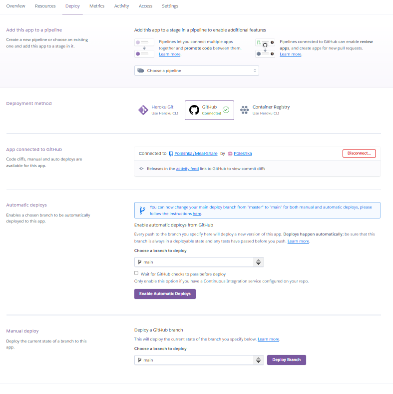

# Welcome to the MealShare 

## 
MealShare is a user-friendly online platform created to help users discover, plan, and explore ideas for their weekly meal planning.
The platform is designed for people who want to be healthy by planning and cooking at home.
The target audience is adults with families who never know what to cook and find meal planning daunting.

This site provides functionality for admins to manage content efficiently.
Users to create an account, add recipes, and view, edit, and delete recipes.

[MealShare](https://meal-share-and-plan-7acdf6e9ad66.herokuapp.com/)

# Index
- [UX/User Stories](#uxuser-stories)
- [Features](#features)
- [Design](#design)
- [Testing and Validation](#testing-and-validation)
- [Deployment](#deployment)
- [Technologies Used](#technologies-used)
- [Credits](#credits)

## User Stories

<table>

  <tr>
    <th>User Story</th>
    <th>Features</th>
    <th>Bugs / Issues</th>
  </tr>

  <tr>
    <td>As a User, I can view a list of recipes and click on the recipe I want to view. </td>
    <td>All the recipes are desplayed on the recipe page.</td>
    <td>None detected</td>
    </tr>

  <tr>
    <td>As a User, I can click on the recipe so that I can read the full description.</td>
    <td>When recipe image/title is clicked, a detailed view of the recipe is displayed.</td>
    <td>None detected</td>
  </tr>

  <tr>
    <td>As a User I can leave comments on the recipe.</td>
    <td>Comments need to be approved by an admin. When approved they are displayed under the recipe.</td>
    <td>None detected</td>
  </tr>

  <tr>
    <td>As a User I can view comments on the individual recipe.</td>
    <td>Give one or more comments the user can view.</td>
    <td>None detected</td>
  </tr>

  <tr>
    <td>As a User, I can register/sign up an accout so that I can add recipe and comment on the individual recipe.</td>
    <td>Given username and password a user can sigup to accout and log in.When logged in they can comment. </td>
    <td>None detected</td>
  </tr>
  
  <tr>
    <td>As a user/admin, I can login so that I can access all the available content.</td>
    <td>User/admin can logout successfully.</td>
    <td>None detected</td>
  </tr>

  <tr>
    <td>As a Admin, I can create draft recipe so that I can finish later, prior to publishing</td>
    <td>I can save draft and finish the content at a later time.</td>
    <td>None detected</td>
  </tr>

  <tr>
    <td>As a Admin I can approve/disapprove comments in order to filter out objectionable comments.</td>
    <td>I can approve or un-approve a comment.</td>
    <td>None detected</td>
  </tr>

  <tr>
    <td>As a User I can search for a recipe or ingredient</td>
    <td>User can enter keywords in the search bar</td>
    <td>Feature for future iteration.</td>
  </tr>

  <tr>
    <td>As a User I can create a meal plan for a week so that I can organize my meals ahead of time.</td>
    <td>I can access a form to fill in, that includes fields: meal names and days of the week </td>
    <td>Feature for future iteration.</td>
  </tr>

  <tr>
    <td> As a User I can add recipes to my meal plan</td>
    <td>User can search for recipes to add them to their plan.User has a displayed plan for a week with his chosen recipes</td>
    <td>Feature for future iterations</td>
  </tr>

  <tr>
    <td>As a User I can generate a shopping list based on my meal plan so that I can purchese all the necessary ingredients.</td>
    <td>I can access shopping with all ingredients for the whole weeks meals.</td>
    <td>Feature for future iteration.</td>
  </tr>

</table>

 

 

## Features

### Home Page

The home page displays the carousel with images and highlights of what is the page about.
In the future, it will display the latest recipes and a link(view) to the weekly meal planner.
.png)

## Navigation Bar

Template from Bootstrap 

## Footer

Simple footer with social links

## Sign Up

The site has a user sign-up facility to add, edit, and delete recipes.

## Log In

After creating accound user can sign in to be able to make changes to their recipes.

## Log Out

The site allows user to sign out of their account

## Admin

This site has standard Django admin interface

## ERD

The following Entity Relationship Diagram data structure was created:
.png)

 

 

# Design

## Design Choices

The layout is built with a simple and minimalist design that places the vibrant images of the dishes at the forefront, creating a visually engaging experience without overwhelming the viewer easy to navigate while keeping the focus on the food.

 **Colors**: 

 **Typography**: 

Google Fonts:
-Oxygen(body text)
-Karla(headings)

- **Layout**:

## Wireframes
- Homepage wireframe showing recipe cards and a search bar.
- Recipe detail page with ingredients, preparation steps, and images.

### Home Page Wireframe Design

### Recipe List/Detail Page Wireframe Design

### Login Page Wireframe Design

# Testing and Validation

- W3 HTML Validator

- W3 CSS Validator

- CI Python Linter

## Manual Testing

<table>

  <tr>
    <th>Test</th>
    <th>PASS/FAIL</th>
  </tr>

  <tr>
    <td>Click Home page</td>
    <td>Pass</td>
  </tr>

  <tr>
    <td>Click Recipe page</td>
    <td>Pass</td>
  </tr>

  <tr>
    <td>Click Add(recipe) page</td>
    <td>Pass</td>
  </tr>

  <tr>
    <td>Click Login page</td>
    <td>Pass</td>
  </tr>

  <tr>
    <td>Click Logout page</td>
    <td>Pass</td>
  </tr>

  <tr>
    <td>Sign Up</td>
    <td>Pass</td>
  </tr>

  <tr>
    <td>Leave a comment</td>
    <td>Pass</td>
  </tr>

  <tr>
    <td>Notification for successul log in.</td>
    <td>Pass</td>
  </tr>

  <tr>
    <td>Notification for successul log out.</td>
    <td>Pass</td>
  </tr>

  <tr>
    <td>See recipe details</td>
    <td>Pass</td>
  </tr>

  <tr>
    <td>Add new recipe</td>
    <td>Pass</td>
  </tr>

  <tr>
    <td>Edit recipe</td>
    <td>Pass</td>
  </tr>

  <tr>
    <td>Notification for successul edit recipe.</td>
    <td>Pass</td>
  </tr>

  <tr>
    <td>Delete recipe</td>
    <td>Pass</td>
  </tr>

  <tr>
    <td>Notification for successul delete.</td>
    <td>Pass</td>
  </tr>

  <tr>
    <td>Searching recipes</td>
    <td>Fail</td>
  </tr>

  <tr>
    <td>Manage recipes(Admin)</td>
    <td>Pass</td>
  </tr>

  <tr>
    <td>Approve comments(Admin)</td>
    <td>Pass</td>
  </tr>

  <tr>
    <td>Generate a shopping list</td>
    <td>Fail</td>
  </tr>

  <tr>
    <td>Add recipes to meal plan</td>
    <td>Fail</td>
  </tr>

  <tr>
    <td>Create meal plan</td>
    <td>Fail</td>
  </tr>

  <tr>
    <td>Rate recipes</td>
    <td>Fail</td>
  </tr>

</table>

# Deployment

The site was deployed to Heroku from the main branch of the repository early in the development stage for continuous deployment and checking.
The Heroku app is setup with 3 environment variables, repalcing the environment variables stored in env.py (which doesn't get pushed to github).

In order to create an Heroku app:
-Click on New in the Heroku dashboard, and Create new app from the menu dropdown.
-Give your new app a unique name, and choose a region, preferably one that is geographically closest to you.

Click "Create app"

In your app settings, click on "Reveal Config Vars" and add the environment variables for your app. These are:
-DATABASE_URL - your database connection string
-SECRET_Key - the secret key for your app
-CLOUDINARY_URL - the cloudinary url for your image store
-The PostgreSQL database is served from ElephantSQL

Once the app setup is complete, click on the Deploy tab and:

connect to the required GitHub account
select the repository to deploy from
click the Deploy Branch button to start the deployment.
Once deployment finishes the app can be launched.

The live link for this project can be found here:[MealShare](https://meal-share-and-plan-7acdf6e9ad66.herokuapp.com/)

# Technologies used
- HTML5- for page structure
- CSS3- for custom styling
- Python- for the backend
- Django- framework used to build this project
- Postgres Database- used as the database
- Google Fonts- for custom font styling
- Heroku - for hosting and deployement of this project
- Cloudinary - hosting the static files
- Git - for version control.
- GitHub is used for setting up and managing project repositories.
- GitHub Project Board are utilized for effectively managing tasks, tracking project progress, and ensuring efficient implementation.
- Balsamiq is used for designing wireframes to visualize project layouts.
- Bootstrap and custom CSS are used to create visually appealing and responsive website, customized to meet specific project needs.

# Credits
- Developers and websites**:
Dee Mc(django Recipe Sharing Tutorial on YouTube ), 
CodeInstitute("I Think Therefore I Blog" walkthrough django project)
https://mdbootstrap.com/

- Chatgpt AI: For debugging and some coding ideas

- Favicon.io: For Favicon generation.

- Google Fonts: For typography.

- Recipes: PickUpLimes[PickUpLimes](https://www.pickuplimes.com/)/AvantGardeVegan[Gaz Oakley](https://www.gazoakleychef.com/)/LazyCatKitchen[LazyCat](https://www.lazycatkitchen.com/)/PeacefulCusine[PeacefulCusine]
- Recipes Images: SEE ABOVE
